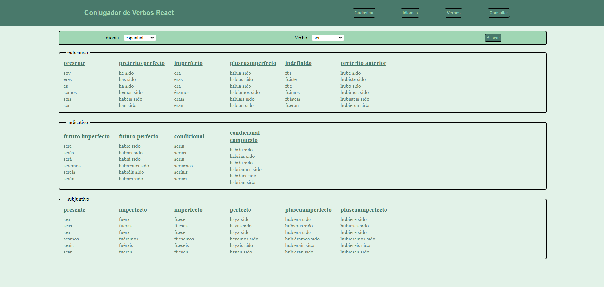
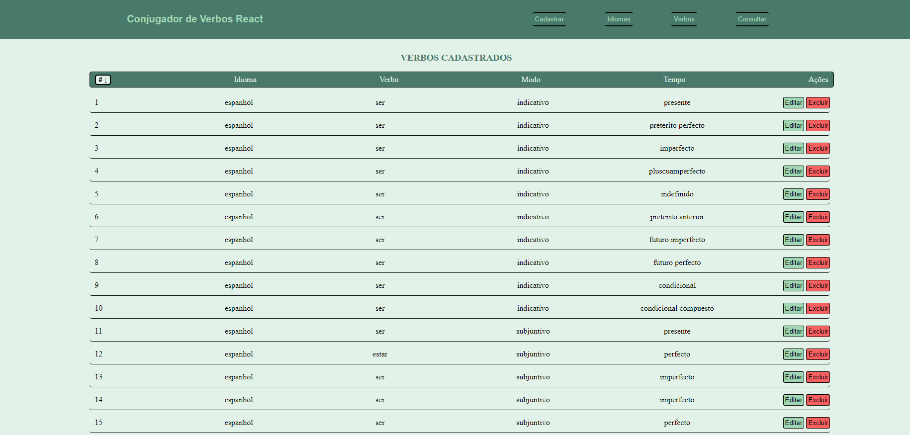
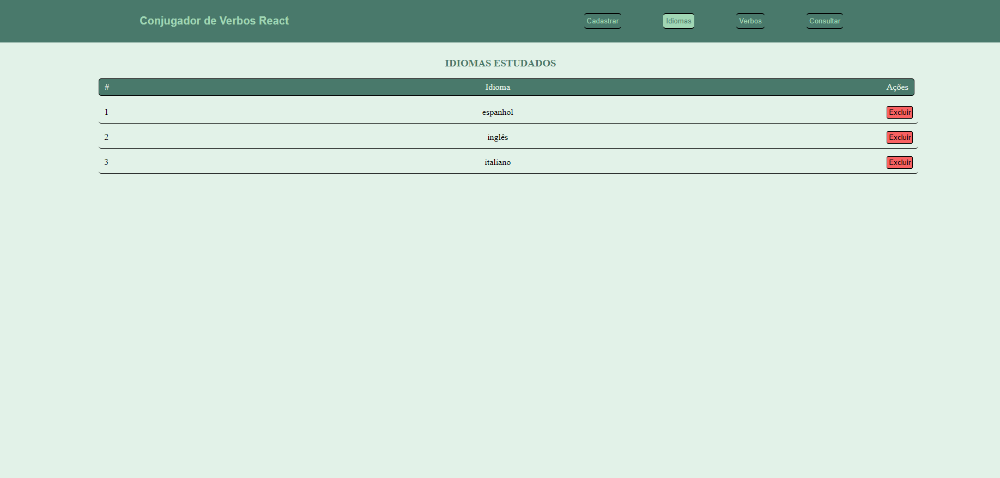
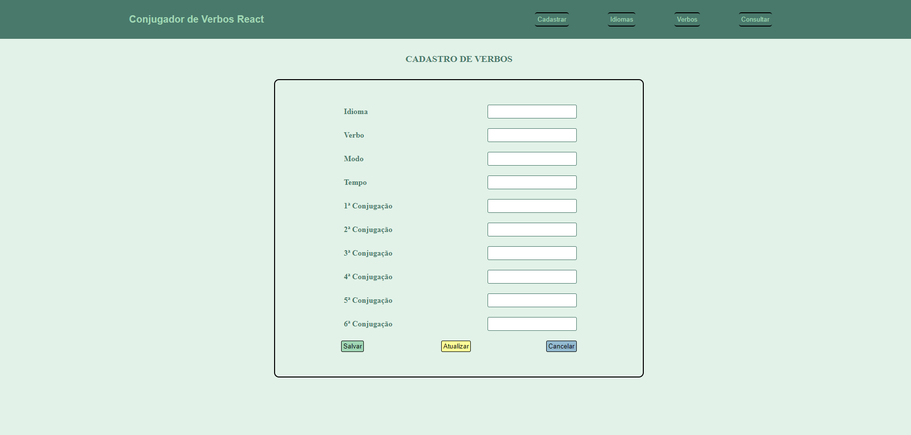

# PROJETO CONJUGADOR DE VERBOS

Projeto pessoal de um conjugador de verbos para estudo de verbos. No programa é possível adicionar verbos informando o idioma, nome do verbo, modo e tempo verbal, assim como sua respectiva conjugação **(figura4)**.

Com os verbos cadastrados é possível realizar a busca de todos os tempos verbais de um específico verbo **(figura1)**. Também é possível consultar uma listagem com todos os verbos cadastrados **(figura2)**, assim como de todos os idiomas cadastrados **(figura3)**.

Na página de listagem dos verbos, é possível alterar a ordem dos verbos cadastros ao clicar no botão do índice numérico da listagem

Ao clicar no botão de excluir na página da listagem de idiomas, será realizada a exclusão de todos os verbos cadastrados do idioma selecionado.

Como banco de dados para inserção dos verbos, foi implementada uma api local com arquivo no formato json

## Para rodar o programa

### No terminal digitar os comandos
> Para iniciar a api: **npm run api**

> Para iniciar o projeto: **npm start**

## Tecnologias utilizada para criação do projeto

>|   |    |   |
>| ------ | ------ | ------ |
>| **React** | **React-router-dom** | **Javascript** |
>| **Axios** | **Styled-Component** | **Uuid** |
>|   |    |   |

## Telas do projeto

Figura1: Página de busca

Figura2: Listagem de verbos

Figura3: Página de idiomas

Figura4: Página de adição e atualização

>*Projeto desenvolvido em novembro/2023*